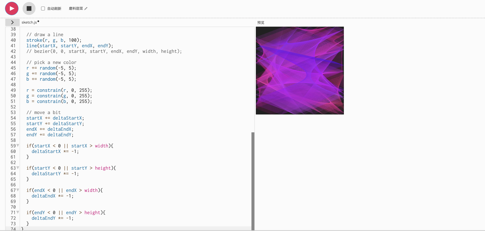

# 0995_9103_tut5 Group E

 # Part 1: Imaging Technique Inspiration


>This is the artwork we chose to make for our big assignment. I want to add animation to the circular pattern.
## Image inspiration maps and links


#### Example 1:From Manolo Gamboa Naon 

[Link Text](https://www.behance.net/gallery/136212779/plopi
)


#### Example 2:From Manolo Gamboa Naon 

[Link Text](https://www.behance.net/gallery/91388425/grrdds
)


#### Example 3:From Manolo Gamboa Naon 

[Link Text](https://www.behance.net/gallery/158225367/glllvvs
)


## P1: Inspiration explanation
```
I love the artist Manoloide's digital art. His artworks are characterized by complex geometric figures and changing colors in ever-changing natural dynamics. This fascinates me deeply.

Three of his works have given me great inspiration.
These artworks have a good visual effect. By using the natural dynamic changes of the line as the core, we create a work that is casual but rich in visual art. The colorful lines overlap and weave together artfully.

I will incorporate these visual inspirations and the use of lines that I observe into my project and animate the scene. I think this will definitely make our project more visually rich.
```
> # Part 2: Coding Technique Exploration

 ## Actual coding technique images and code links

 >### From Tutorials tagged genuary





[Link Text](https://happycoding.io/tutorials/p5js/animation/bouncing-line
)


## P2: Coding technique interpretation

```
In the first part of the artwork, I think randomness is a very important factor. I will apply this part of the technique to the circular pattern in the artwork to increase the visual effect.
```

- Random() function displays random coordinates and color values, adding variety and randomness.

-   Draw function controls the animation in several circular patterns to maintain a continuous drawing effect.


-  line function  make the overlap and cross of lines present interesting visual effects, I will try to control the thickness and density of the appearance, so that my picture is more beautiful.

- Keep the color value within a reasonable range by using the RGB value and constrain number, and I will choose the appropriate color to match in the next big assignment.

- The stroke function sets the transparency of the color, which helps the lines remain beautiful when stacked.
